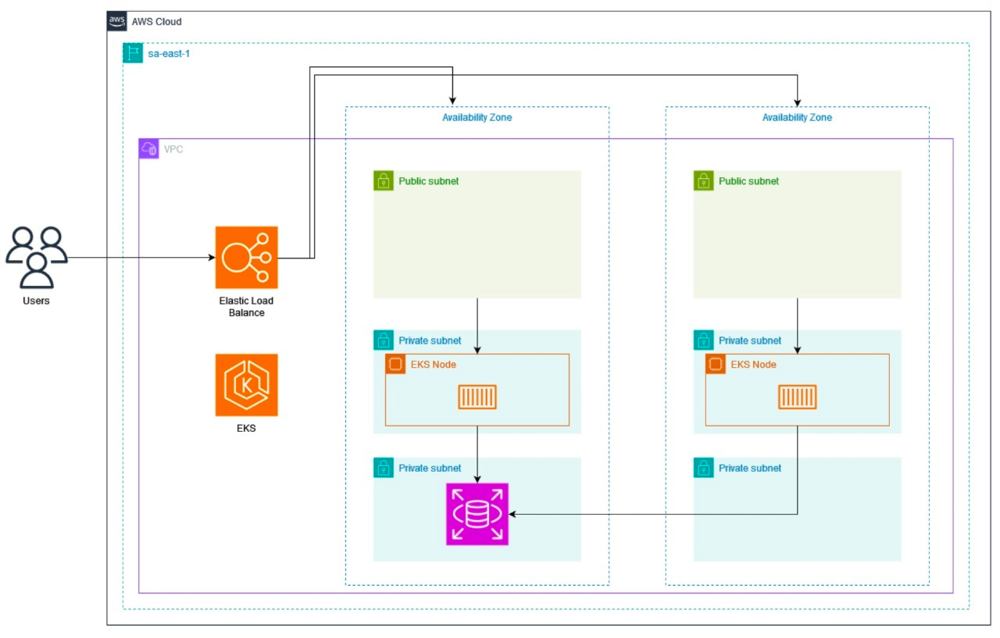
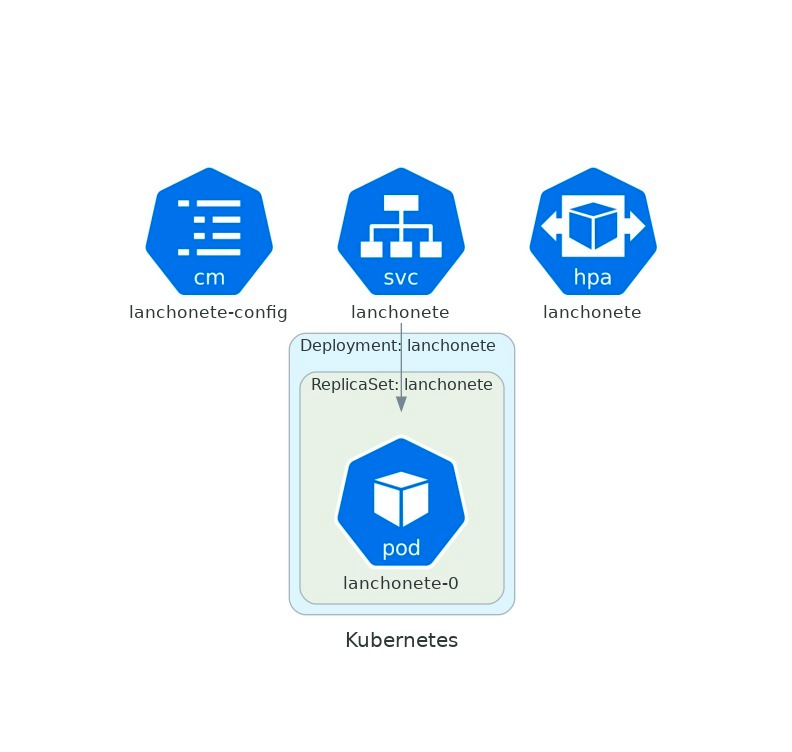
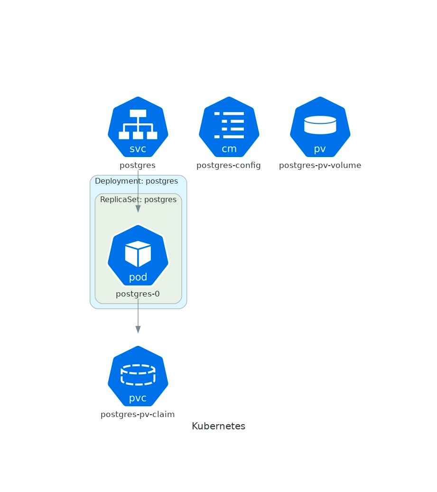
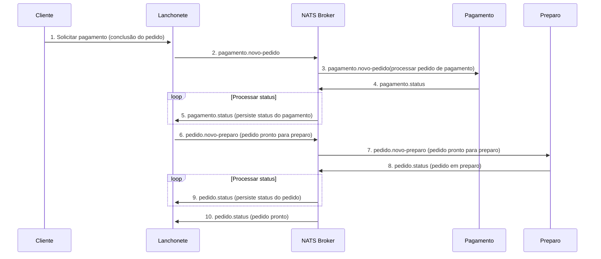

# Documentação e Desenho da arquitetura

### Requisitos de negócio

#### Problema

Há uma lanchonete de bairro que está expandindo devido seu grande sucesso. Porém, com a expansão e sem um sistema de
controle de pedidos, o atendimento aos clientes pode ser caótico e confuso. Por exemplo, imagine que um cliente faça um
pedido complexo, como um hambúrguer personalizado com ingredientes específicos, acompanhado de batatas fritas e uma
bebida. O atendente pode anotar o pedido em um papel e entregá-lo à cozinha, mas não há garantia de que o pedido será
preparado corretamente.

Sem um sistema, pode haver confusão entre os atendentes e a cozinha, resultando em atrasos na preparação e entrega dos
pedidos. Os pedidos podem ser perdidos, mal interpretados ou esquecidos, levando à insatisfação dos clientes e à perda
de negócios.

### Solução

Com base no problema informado, a solução vai ser criar um sistema de controle de pedidos, para garantir que a
lanchonete possa atender os clientes de maneira eficiente, gerenciando seus pedidos e estoques de forma adequada:

O sistema precisa ter:

- Gerenciamento de estoque dos produtos: O sistema deve ser capaz de gerenciar o estoque de produtos a venda da
  lanchonete.
- Controle de pedidos: O sistema deve permitir que os clientes façam pedidos sem interagir com um atendente, podendo
  escolher até 3 items nesse pedido.
- Eficiência operacional: O sistema deve garantir que os pedidos sejam preparados e entregues de forma eficiente,
  minimizando atrasos e erros.
- Atendimento ao cliente: O sistema deve garantir que os clientes sejam atendidos de maneira eficiente e que seus
  pedidos sejam preparados corretamente informando em tempo real o andamento do pedido e notificando o cliente quando o
  pedido esta pronto.

Abaixo está os diagramas de infraestrutura desse sistema.

### Infraestrutura na nuvem

### Kubernetes

#### Serviço

#### Banco de Dados

#### Serviços externos

O serviço principal (Lanchonete)  , comunica-se via mensageria com o serviço de pagamento e o serviço de preparo de
pedidos. A comunicação é feita através de um broker NATS detalhada abaixo.

