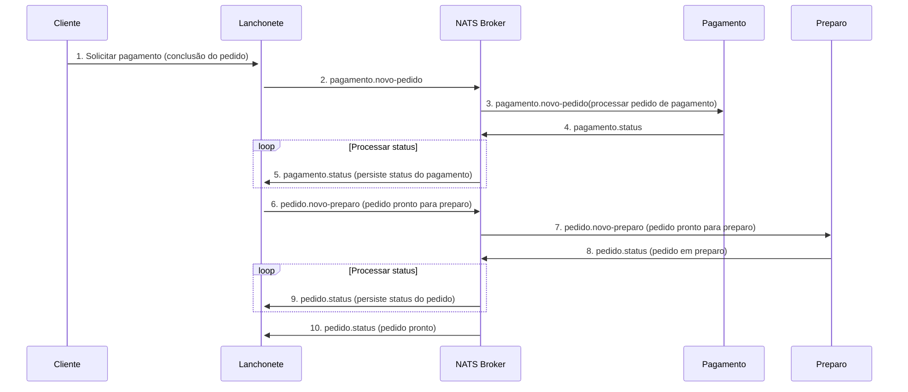

# Documentação e Desenho da arquitetura

### Requisitos de negócio

#### Problema

Há uma lanchonete de bairro que está expandindo devido seu grande sucesso. Porém, com a expansão e sem um sistema de
controle de pedidos, o atendimento aos clientes pode ser caótico e confuso. Por exemplo, imagine que um cliente faça um
pedido complexo, como um hambúrguer personalizado com ingredientes específicos, acompanhado de batatas fritas e uma
bebida. O atendente pode anotar o pedido em um papel e entregá-lo à cozinha, mas não há garantia de que o pedido será
preparado corretamente.

Sem um sistema, pode haver confusão entre os atendentes e a cozinha, resultando em atrasos na preparação e entrega dos
pedidos. Os pedidos podem ser perdidos, mal interpretados ou esquecidos, levando à insatisfação dos clientes e à perda
de negócios.

### Solução

Com base no problema informado, a solução vai ser criar um sistema de controle de pedidos, para garantir que a
lanchonete possa atender os clientes de maneira eficiente, gerenciando seus pedidos e estoques de forma adequada:

O sistema precisa ter:

- Gerenciamento de estoque dos produtos: O sistema deve ser capaz de gerenciar o estoque de produtos a venda da
  lanchonete.
- Controle de pedidos: O sistema deve permitir que os clientes façam pedidos sem interagir com um atendente, podendo
  escolher até 3 items nesse pedido.
- Eficiência operacional: O sistema deve garantir que os pedidos sejam preparados e entregues de forma eficiente,
  minimizando atrasos e erros.
- Atendimento ao cliente: O sistema deve garantir que os clientes sejam atendidos de maneira eficiente e que seus
  pedidos sejam preparados corretamente informando em tempo real o andamento do pedido e notificando o cliente quando o
  pedido esta pronto.

Abaixo está os diagramas de infraestrutura desse sistema.

### Infraestrutura na nuvem

### Kubernetes

#### Serviço

#### Banco de Dados

### Coreografia do pedido

O fluxo de pagamento em sua aplicação é gerenciado por uma SAGA coreografada. Aqui está a documentação detalhada do fluxo:

1. **Início da SAGA (Cliente -> Lanchonete)**: A SAGA começa quando o cliente conclui o pedido e solicita o pagamento. Esta ação é tratada pelo serviço Lanchonete.

2. **Evento de Novo Pedido de Pagamento (Lanchonete -> NATS Broker)**: O serviço Lanchonete publica um evento `pagamento.novo-pedido` no broker NATS. Este evento contém os detalhes do pedido que precisa ser processado.

3. **Processamento do Pedido de Pagamento (NATS Broker -> Pagamento)**: O serviço Pagamento, que está escutando o evento `pagamento.novo-pedido`, recebe o evento do broker NATS e começa a processar o pedido de pagamento.

4. **Publicação do Status do Pagamento (Pagamento -> NATS Broker)**: Uma vez que o pagamento é processado, o serviço Pagamento publica um evento `pagamento.status` no broker NATS. Este evento contém o status do pagamento.

5. **Atualização do Status do Pagamento (NATS Broker -> Lanchonete)**: O serviço Lanchonete, que está escutando o evento `pagamento.status`, recebe o evento do broker NATS e atualiza o status do pagamento em seu banco de dados.

6. **Alternativamente**: Se o pagamento falhar, o fluxo não prossegue e o cliente é notificado sobre o erro.

7. **Evento de Novo Pedido de Preparo (Lanchonete -> NATS Broker)**: Uma vez que o pagamento é bem-sucedido, o serviço Lanchonete publica um evento `pedido.novo-preparo` no broker NATS. Este evento indica que o pedido está pronto para ser preparado.

8. **Preparação do Pedido (NATS Broker -> Preparo)**: O serviço Preparo, que está escutando o evento `pedido.novo-preparo`, recebe o evento do broker NATS e começa a preparar o pedido.

9. **Publicação do Status do Pedido (Preparo -> NATS Broker)**: À medida que o pedido é preparado, o serviço Preparo publica eventos `pedido.status` no broker NATS. Estes eventos contêm o status atual do pedido.

10. **Atualização do Status do Pedido (NATS Broker -> Lanchonete)**: O serviço Lanchonete, que está escutando o evento `pedido.status`, recebe os eventos do broker NATS e atualiza o status do pedido em seu banco de dados.

11. **Fim da SAGA (NATS Broker -> Lanchonete)**: A SAGA termina quando o pedido está pronto para ser entregue ao cliente. O serviço Lanchonete recebe um evento final `pedido.status` com o status "pronto" do broker NATS.

Este fluxo garante que todas as etapas do processo de pedido e pagamento sejam realizadas em ordem e que o estado do pedido seja mantido consistente em todos os serviços.

#### Motivo de escolha do SAGA coreografada

A arquitetura SAGA coreografada é uma abordagem descentralizada para lidar com transações distribuídas, onde cada serviço envolvido no processo de negócio é responsável por publicar eventos e reagir a eventos de outros serviços. Neste caso, cada serviço sabe o que fazer quando um evento específico ocorre.

No documento, a SAGA coreografada é usada para gerenciar o fluxo de pedidos em uma lanchonete. Cada serviço (Lanchonete, Pagamento, Preparo) publica eventos e reage a eventos de outros serviços para processar um pedido.

Aqui estão algumas razões pelas quais a SAGA coreografada foi preferida à SAGA orquestrada neste cenário:

1. **Desacoplamento**: Cada serviço é independente e só precisa saber sobre os eventos que lhe interessam. Isso torna o sistema mais flexível e fácil de modificar ou estender.

2. **Escalabilidade**: Como não há um único ponto de coordenação, o sistema pode escalar melhor. Cada serviço pode ser escalado de forma independente com base em suas próprias necessidades.

3. **Resiliência**: Se um serviço falhar, ele não interromperá todo o processo. Outros serviços podem continuar processando seus próprios eventos.

4. **Simplicidade**: Não há necessidade de um orquestrador central, o que pode simplificar o design e a implementação do sistema.

Como o processo da lanchonete é um projeto relativamente simples, a SAGA coreografada foi escolhida como a melhor abordagem para gerenciar o fluxo.

