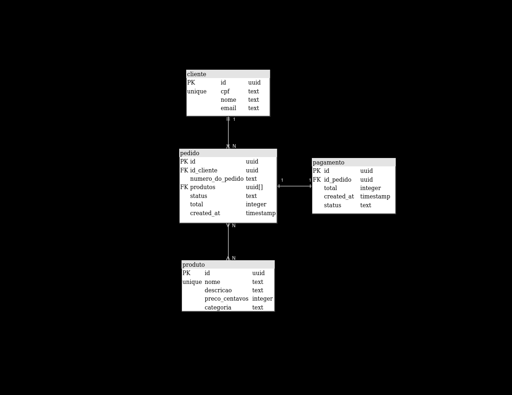

# Documentação Banco de Dados

### Tabelas:

- **Cliente**

Tabela responsavel por salvar dados dos clientes.

        id: Identificador único do cliente.
        cpf: Número de CPF do cliente.
        nome: Nome completo do cliente.
        email: Endereço de e-mail do cliente.

- **Pedido**

Tabela responsavel por guardar dados do pedido, todo pedido feito é salvo nessa tabela.

        id_cliente: Chave estrangeira que relaciona o pedido ao cliente.
        numero_do_pedido: Número único do pedido.
        produtos: Lista de produtos incluídos no pedido.
        status: Status atual do pedido (por exemplo, “pendente”, “entregue”).
        total: Valor total do pedido.
        created_at: Data e hora de criação do pedido.

- **Produto**

Tabela responsavel por guardar dados de produtos.

        id: Identificador único do produto.
        nome: Nome do produto.
        descricao: Descrição detalhada do produto.
        preco_centavos: Preço do produto em centavos.
        categoria: Categoria à qual o produto pertence (por exemplo, “eletrônicos”, “vestuário”).

### Porque PostgreSQL:

    - Modelagem e Relacionamento entre entidadas: O PostgreSQL permite modelar relacionamentos entre os dados, como pedido e pagamento de forma facil
    - Suporte a Transações ACID: O PostgreSQL oferece suporte a transações ACID (Atomicidade, Consistência, Isolamento e Durabilidade), garantindo a integridade dos dados.
    - Recursos Avançados: Oferece recursos avançados, como índices, consultas complexas, funções armazenadas e gatilhos.
    - Comunidade Ativa: A comunidade PostgreSQL é ativa, fornecendo suporte, atualizações e correções constantes.
    - Licença Open Source: O PostgreSQL é de código aberto e gratuito.

Em resumo, o PostgreSQL é uma excelente opção para bancos de dados relacionais, especialmente quando se lida com muitos relacionamentos.