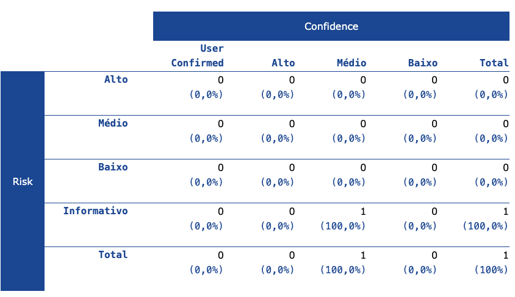

## Contents

1. [About this report](#about-this-report)
   1. [Report description](#report-description)
   2. [Report parameters](#report-parameters)

- [Summaries](#summaries)
  1. [Alert counts by risk and confidence](#risk-confidence-counts)
  2. [Alert counts by site and risk](#site-risk-counts)
  3. [Alert counts by alert type](#alert-type-counts)
- [Alerts](#alerts)
  1. [Risk\=Informativo, Confidence\=Médio (1)](#alerts--risk-0-confidence-2)
- [Appendix](#appendix)
  1. [Alert types](#alert-types)

## About this report

### Report description

O report foi gerado para as rotas: \`\[POST\] /pedido\` e \`\[GET\] /produtos/lanche\`. No cenário do nosso app, não temos rotas expostas para pagamento. Todo o fluxo de pagamento e confirmação do mesmo funciona via SAGA, não deixando exposto esse serviço e contexto.

### Report parameters

#### Contexts

The following contexts were selected to be included:

- GET:lanche
- POST:pedido()({ "id-cliente": "fbe9029d-28e6-43c7-9b4...)

#### Sites

The following sites were included:

- <http://localhost:8080>

(If no sites were selected, all sites were included by default.)

An included site must also be within one of the included contexts for its data to be included in the report.

#### Risk levels

Included: Alto, Médio, Baixo, Informativo

Excluded: None

#### Confidence levels

Included: User Confirmed, Alto, Médio, Baixo

Excluded: User Confirmed, Alto, Médio, Baixo, Falso Positivo

## Summaries

### Alert counts by risk and confidence

This table shows the number of alerts for each level of risk and confidence included in the report.

(The percentages in brackets represent the count as a percentage of the total number of alerts included in the report, rounded to one decimal place.)

### Alert counts by site and risk

This table shows, for each site for which one or more alerts were raised, the number of alerts raised at each risk level.

Alerts with a confidence level of "False Positive" have been excluded from these counts.

(The numbers in brackets are the number of alerts raised for the site at or above that risk level.)

|          | Risk       |            |                  |
| -------- | ---------- | ---------- | ---------------- |
| Alto     | Médio      | Baixo      | Informativo      |
| (= Alto) | (>= Médio) | (>= Baixo) | (>= Informativo) |

### Alert counts by alert type

This table shows the number of alerts of each alert type, together with the alert type's risk level.

(The percentages in brackets represent each count as a percentage, rounded to one decimal place, of the total number of alerts included in this report.)

| Alert type        | Risk        | Count      |
| ----------------- | ----------- | ---------- |
| User Agent Fuzzer | Informativo | 12         |
|                   |             | (1.200,0%) |
| Total             |             | 1          |

## Alerts

#### Risk=Informativo, Confidence=Médio (1)

## Appendix

### Alert types

This section contains additional information on the types of alerts in the report.

1. #### User Agent Fuzzer

<table><tbody><tr><th scope="row">Source</th><td>raised by an active scanner (<a href="https://www.zaproxy.org/docs/alerts/10104/">User Agent Fuzzer</a>)</td></tr><tr><th scope="row">Reference</th><td><ol><li><a href="https://owasp.org/wstg">https://owasp.org/wstg</a></li></ol></td></tr></tbody></table>
